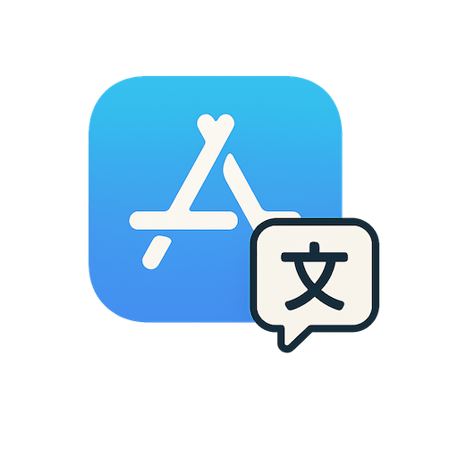

# fastlane-plugin-translate

<div align="center">
  
</div>

[](https://rubygems.org/gems/fastlane-plugin-translate)
[](https://badge.fury.io/rb/fastlane-plugin-translate)
[](https://ko-fi.com/D1D6P4LAR)

## About translate

Automatically translate iOS `Localizable.xcstrings` files and App Store metadata using DeepL API. This plugin helps you efficiently manage app localization by translating untranslated strings while preserving your existing translations, and seamlessly translate App Store metadata files like release notes and descriptions to all your supported languages.

## Features

### App Strings Translation

- **Language selection with progress**: Shows translation completeness for each language
- **Smart targeting**: Only translates missing strings, preserves existing translations
- **Formality options**: Formal/informal translation styles for supported languages
- **Context-aware translation**: Uses xcstrings comments to improve translation quality
- **Progress tracking**: Resume interrupted translations without starting over
- **Automatic backups**: Safe translation with rollback capability
- **Error recovery**: Handle API failures gracefully with retry options

### App Store Metadata Translation

- **Auto-detection**: Automatically detects target languages from existing metadata directories
- **Smart mapping**: Handles App Store locale directory names to DeepL language codes
- **Multiple files**: Translate release notes, descriptions, keywords, or any metadata file
- **Batch translation**: Translate to all supported languages in one command
- **Error resilience**: Continues translating other languages if one fails

## Getting Started

### Install from RubyGems (Recommended)

```bash
fastlane add_plugin translate
```

### Install from GitHub (Latest Development Version)

Add to your `Gemfile`:

```ruby
gem "fastlane-plugin-translate", git: "https://github.com/tijs/fastlane-plugin-translate"
```

Then run:

```bash
bundle install
```

## Setup

1. **Get a DeepL API key** from <https://www.deepl.com/pro#developer>
2. **Set your API key** as an environment variable:

   ```bash
   export DEEPL_AUTH_KEY="your-deepl-api-key-here"
   ```

## Usage

### Basic Usage

After installation, create a lane in your Fastfile and run it:

```bash
fastlane ios translate
```

**Simple dedicated lane:**

```ruby
lane :translate do
  translate_with_deepl
end
```

**Within complex workflows:**

```ruby
lane :prepare_release do
  build_app
  translate_with_deepl(target_language: "de")
  upload_to_testflight
  slack(message: "New build with German translations available!")
end
```

### Specify Target Language

```ruby
# Translate to German
translate_with_deepl(target_language: "de")

# Translate to French with formal style
translate_with_deepl(
  target_language: "fr", 
  formality: "more"
)
```

### Custom Configuration

```ruby
# Full configuration example
translate_with_deepl(
  xcstrings_path: "./MyApp/Localizable.xcstrings",
  target_language: "es",
  formality: "prefer_more",
  batch_size: 15,
  free_api: true
)
```

## App Store Metadata Translation

In addition to translating app strings, the plugin can translate App Store metadata files like release notes, descriptions, and keywords using the `translate_metadata_with_deepl` action.

### Features

- **Auto-detection**: Automatically detects target languages from existing metadata directories
- **Smart mapping**: Handles App Store locale directory names (e.g., `de-DE`, `fr-FR`) to DeepL language codes
- **Multiple files**: Translate `release_notes.txt`, `description.txt`, `keywords.txt`, or any metadata file
- **Backup creation**: Creates backups before translation for safety
- **Progress tracking**: Shows translation progress for each language
- **Error resilience**: Continues translating other languages if one fails

### Basic Metadata Translation

```ruby
# Translate release notes to all detected languages
translate_metadata_with_deepl(
  file_name: "release_notes.txt"
)
```

### Fastfile Examples

```ruby
# Translate release notes to all supported languages
lane :release_notes_translate do
  translate_metadata_with_deepl(
    metadata_path: "./fastlane/metadata",
    source_locale: "en-US",
    file_name: "release_notes.txt",
    formality: "prefer_less"
  )
end

# Translate app description
lane :description_translate do
  translate_metadata_with_deepl(
    file_name: "description.txt",
    formality: "prefer_more"
  )
end

# Translate any metadata file
lane :translate_metadata do |options|
  file_name = options[:file] || UI.input("Enter metadata file name: ")
  
  translate_metadata_with_deepl(
    file_name: file_name,
    formality: "prefer_less"
  )
end
```

### Advanced Configuration

```ruby
# Translate only to specific languages
translate_metadata_with_deepl(
  file_name: "release_notes.txt",
  target_languages: ["de", "fr", "es", "ja"],
  formality: "more"
)

# Use custom metadata path and source locale
translate_metadata_with_deepl(
  metadata_path: "./custom/metadata",
  source_locale: "en-GB",
  file_name: "keywords.txt",
  formality: "prefer_less"
)
```

### Metadata Translation Parameters

| Parameter | Description | Default | Required |
|-----------|-------------|---------|----------|
| `metadata_path` | Path to fastlane metadata directory | `./fastlane/metadata` | No |
| `source_locale` | Source language locale (e.g., en-US) | `en-US` | No |
| `file_name` | Metadata file to translate | `release_notes.txt` | No |
| `target_languages` | Specific languages to translate to | Auto-detected | No |
| `formality` | Translation formality setting | Language default | No |
| `api_token` | DeepL API authentication key | `ENV['DEEPL_AUTH_KEY']` | Yes |
| `free_api` | Use DeepL Free API endpoint | `false` | No |

### Example Output

```
🔍 Auto-detecting target languages from metadata directories...
📁 Found metadata directories for: de, fr, es, ja, ko, zh-Hans
✅ DeepL API key validated
💾 Backup created: ./fastlane/metadata/en-US/release_notes.txt.backup_20241201_163535

📋 Translating release_notes.txt from en-US to 6 languages:
  • German (de)
  • French (fr)
  • Spanish (es)
  • Japanese (ja)
  • Korean (ko)
  • Chinese (Simplified) (zh-Hans)

🔄 Translating to German (de)...
✅ de: Translation completed
🔄 Translating to French (fr)...
✅ fr: Translation completed
🔄 Translating to Spanish (es)...
✅ es: Translation completed

🎉 Metadata translation completed!
📊 Successfully translated release_notes.txt for 6 languages
📄 Backup saved: ./fastlane/metadata/en-US/release_notes.txt.backup_20241201_163535
```

### Directory Structure

The action expects and maintains the standard fastlane metadata structure:

```
fastlane/
└── metadata/
    ├── en-US/           # Source locale
    │   ├── release_notes.txt
    │   ├── description.txt
    │   └── keywords.txt
    ├── de-DE/           # German
    │   ├── release_notes.txt
    │   └── description.txt
    ├── fr-FR/           # French
    │   └── release_notes.txt
    └── ja/              # Japanese
        └── release_notes.txt
```

### Language Mapping

The plugin automatically handles App Store locale directory naming:

| App Store Directory | DeepL Language Code | Language |
|---------------------|---------------------|----------|
| `de-DE` | `de` | German |
| `fr-FR` | `fr` | French |
| `es-ES` | `es` | Spanish |
| `nl-NL` | `nl` | Dutch |
| `no` | `nb` | Norwegian Bokmål |
| `pt-BR` | `pt-BR` | Portuguese (Brazil) |
| `pt-PT` | `pt-PT` | Portuguese (Portugal) |
| `zh-Hans` | `zh` | Chinese (Simplified) |

### Shared Values

The metadata translation action sets these shared values:

- `TRANSLATE_METADATA_WITH_DEEPL_TRANSLATED_COUNT` - Number of languages successfully translated
- `TRANSLATE_METADATA_WITH_DEEPL_TARGET_LANGUAGES` - Array of target language codes that were translated
- `TRANSLATE_METADATA_WITH_DEEPL_BACKUP_FILE` - Path to the backup file created

```ruby
lane :translate_and_upload do
  count = translate_metadata_with_deepl(file_name: "release_notes.txt")
  
  if count > 0
    upload_to_app_store(skip_binary_upload: true)
    slack(message: "✅ Translated release notes for #{count} languages and uploaded!")
  end
end
```

## Supported Languages

The plugin supports all languages available in both Apple's App Store Connect and DeepL API:

### Full DeepL Support

- 🇩🇪 German (de) - *supports formality*
- 🇫🇷 French (fr) - *supports formality*  
- 🇮🇹 Italian (it) - *supports formality*
- 🇪🇸 Spanish (es) - *supports formality*
- 🇳🇱 Dutch (nl) - *supports formality*
- 🇵🇱 Polish (pl) - *supports formality*
- 🇵🇹 Portuguese (pt-BR, pt-PT) - *supports formality*
- 🇯🇵 Japanese (ja) - *supports formality*
- 🇷🇺 Russian (ru) - *supports formality*
- 🇬🇧 English (en-US, en-GB)
- 🇨🇳 Chinese (zh-Hans, zh-Hant)
- 🇰🇷 Korean (ko)
- And many more...

*Languages marked with "supports formality" offer formal/informal translation options*

## Parameters

| Parameter | Description | Default | Required |
|-----------|-------------|---------|----------|
| `api_token` | DeepL API authentication key | `ENV['DEEPL_AUTH_KEY']` | Yes |
| `xcstrings_path` | Path to Localizable.xcstrings file | Auto-detected | No |
| `target_language` | Target language code (e.g., "de", "fr") | User prompted | No |
| `batch_size` | Number of strings per API call | 20 | No |
| `free_api` | Use DeepL Free API endpoint | false | No |
| `formality` | Translation formality level | Auto-detected | No |

### Formality Options

For supported languages, you can specify:

- `default` - Standard formality
- `more` - More formal language
- `less` - Less formal language  
- `prefer_more` - Formal if available, otherwise default
- `prefer_less` - Informal if available, otherwise default

## Example Output

```
🔍 Found xcstrings file: ./Kilowatt/Localizable.xcstrings
✅ DeepL API key validated
💾 Backup created: ./Kilowatt/Localizable.xcstrings.backup_20241201_143022

📋 Available languages for translation:
1. German (de): 45.2% translated (127 remaining) [supports formality]
2. French (fr): 21.8% translated (220 remaining) [supports formality]
3. Spanish (es): 18.1% translated (231 remaining) [supports formality]

🎭 German supports formality options. Choose style:
→ more (formal)

🔄 Translating from EN to DE
📝 Found 127 untranslated strings

🔄 Translating batch 1/7 (20 strings)...
✅ Batch 1 completed (20 strings)
🔄 Translating batch 2/7 (20 strings)...
✅ Batch 2 completed (20 strings)
...

📝 Updating xcstrings file with 127 translations...
💾 Updated xcstrings file
✅ Updated xcstrings file is valid JSON

🎉 Translation completed!
📊 Translated 127 strings for German (de)
📄 Backup saved: ./Kilowatt/Localizable.xcstrings.backup_20241201_143022
🗑️  You can delete the backup after verifying results
```

## Error Handling

The plugin provides comprehensive error recovery:

### Rate Limiting

```
⚠️ Rate limit exceeded for batch 3/10
1. Wait 60s and retry
2. Skip this batch  
3. Abort translation
```

### Translation Errors

```
❌ Translation error for batch 2/10: Network timeout
1. Skip this batch
2. Retry batch
3. Abort translation
```

### API Quota Issues

```
❌ DeepL quota exceeded. Upgrade your plan or wait for reset.
```

## Shared Values

The action sets the following shared values for use in other lanes:

- `TRANSLATE_WITH_DEEPL_TRANSLATED_COUNT` - Number of translated strings
- `TRANSLATE_WITH_DEEPL_TARGET_LANGUAGE` - Target language code
- `TRANSLATE_WITH_DEEPL_BACKUP_FILE` - Path to backup file

```ruby
lane :translate_and_notify do
  count = translate_with_deepl(target_language: "de")
  
  slack(
    message: "✅ Translated #{count} German strings!",
    channel: "#localization"
  )
end
```

## Progress Tracking

The plugin automatically saves translation progress:

```
📈 Found existing progress: 45 strings translated
Continue from where you left off?
1. Yes, continue
2. No, start fresh
```

Progress files are automatically cleaned up after successful completion.

## Context Support

When xcstrings files contain comments, they're used as translation context:

```json
{
  "Hello World": {
    "comment": "Greeting message shown on app launch",
    "localizations": { ... }
  }
}
```

This comment becomes context for better translation quality.

## Requirements

- Ruby >= 2.6
- Fastlane >= 2.0.0
- DeepL API account (Free or Pro)

## Development

### Setup

1. Clone the repository
2. Run `bundle install`

### Testing

#### Unit Tests (RSpec)

Run the full test suite:

```bash
bundle exec rspec
```

Run specific test files:

```bash
bundle exec rspec spec/translate_with_deepl_action_spec.rb
bundle exec rspec spec/language_registry_spec.rb
bundle exec rspec spec/deepl_language_mapper_spec.rb
```

#### Code Quality

Run RuboCop for style checking:

```bash
bundle exec rubocop
```

Auto-fix correctable issues:

```bash
bundle exec rubocop -a
```

#### Manual Testing

To test the plugin manually with a real project:

```bash
# Export your DeepL API key
export DEEPL_AUTH_KEY="your-api-key-here"

# Test the plugin
bundle exec fastlane translate_with_deepl
```

### Requirements

- Ruby >= 3.4
- Fastlane >= 2.0.0
- DeepL API account (Free or Pro) for manual testing

## Issues and Feedback

For bugs, feature requests, or questions, please [create an issue](https://github.com/yourusername/fastlane-plugin-translate/issues).

## License

This project is licensed under the MIT License - see the [LICENSE](LICENSE) file for details.

## About fastlane

[fastlane](https://fastlane.tools) is the easiest way to automate beta deployments and releases for your iOS and Android apps. To get started with fastlane, check out [fastlane.tools](https://fastlane.tools).
